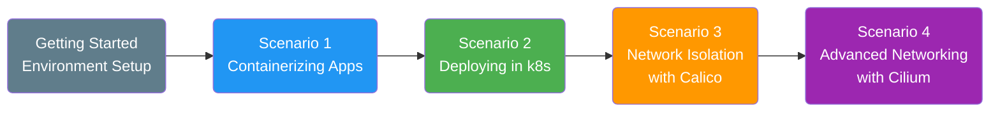

# Introduction to k8s for Cisco SE using KinD

This hands-on Scenario series is designed to build practical familiarity with the core concepts of Kubernetes (k8s) through guided, step-by-step exercises.

The workshop is based on KinD (Kubernetes-in-Docker), a lightweight and accessible way to run Kubernetes clusters locally. KinD provides an ideal environment for learning and experimentation, allowing you to create, manage, and reset clusters quickly without requiring a full production infrastructure.

The primary objective of these Scenarios is to ensure participants become comfortable with foundational Kubernetes building blocks, including:

- Kubernetes manifests (YAML-based configuration)
- Pods and Deployments
- Services and external connectivity
- Networking fundamentals and Network Policies

These concepts directly relate to modern cloud-native application delivery and security, and they provide the groundwork for understanding Cisco's Cloud Protection Suite, including Isovalent and its ecosystem.

All Scenarios are delivered in a pre-configured Cisco dCloud environment, where required tools and dependencies are already installed. This allows you to focus entirely on the hands-on tasks rather than setup or troubleshooting.

**Keywords**: k8s, kind, cilium, cni, docker, compose, container, pods, deployment, helm, kubectl.

---

## Content

### Getting Started: Navigating the Infrastructure

### Scenario 1: Containerizing Applications

### Scenario 2: Deploying Apps in Kubernetes with KinD

### Scenario 3: Network Isolation with Calico in Kubernetes

### Scenario 4: Advanced Networking with Cilium CNI
